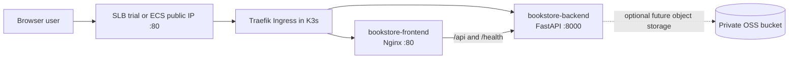
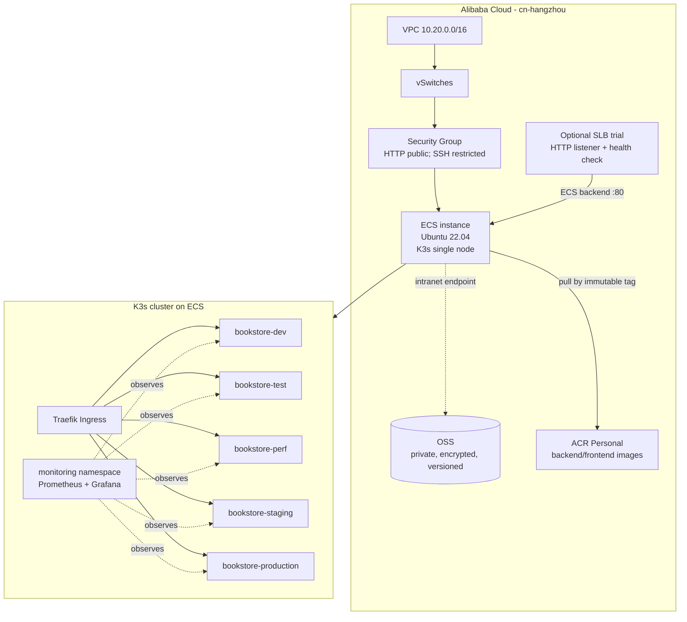
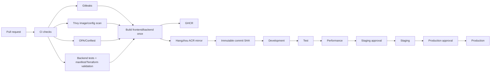

# Platform Architecture

This document is the implementation view of the Online Book Store platform.
The running demonstration uses one Alibaba Cloud ECS instance in Hangzhou with
K3s. Five application environments are namespaces in that cluster; they are not
five separate ECS or Kubernetes clusters.

## Application architecture

The current catalog is an in-memory demonstration dataset. The private OSS
bucket is provisioned by Terraform as the storage foundation and is not needed
for the current read-only API path. The ingress host is represented by the ECS
public IP for this cost-controlled demonstration, so a DNS name and TLS
certificate are deliberately out of scope.

## Infrastructure architecture

Terraform manages the VPC, vSwitch, security group, adopted ECS foundation,
K3s bootstrap inputs, and OSS bucket. `enable_slb` and `enable_alb` are mutually
exclusive and default to `false`. The selected cost-controlled path is the
account's free SLB trial; when it is not active, the ECS public IP remains the
fallback entry point. The SLB trial instance is imported into Terraform, after
which Terraform manages its HTTP listener, health check and ECS backend.

## Delivery pipeline

The deployment workflow accepts only a full 40-character Git SHA. Kustomize
renders the selected namespace, the same image reference is used in every
stage, and the protected `terraform-apply` environment gates the cloud apply.
ECS Cloud Assistant performs the idempotent K3s apply, rollout checks, HTTP
smoke tests, and monitoring smoke test.
