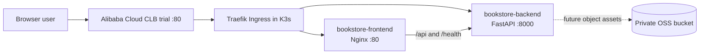
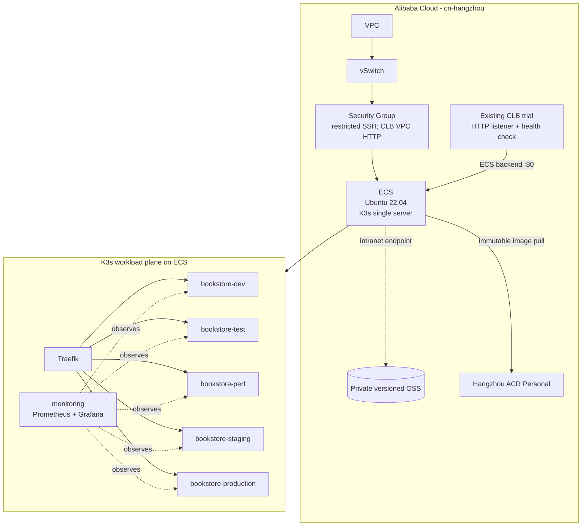
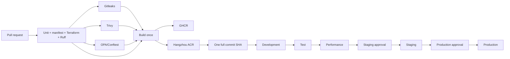

# Platform Architecture

This is the implementation view of the Online Book Store platform. The live
demonstration uses one Alibaba Cloud ECS instance in Hangzhou with a single
K3s server. The five application environments are namespaces in that shared
cluster, not five infrastructure copies.

## Application architecture

The current catalog is an in-memory demonstration dataset. OSS is provisioned
as the private storage foundation but is not required by the read-only API.
The production overlay has a hostless fallback ingress so the CLB public IP
works without purchasing a domain. DNS and TLS are intentionally out of scope.

## Infrastructure architecture

Terraform manages the VPC, adopted vSwitch/security group/ECS foundation,
CLB listener integration, and OSS bucket. Only the existing Hangzhou CLB
trial is retained as the public entry point. No ALB or NLB trial is activated.

## Load-balancer decision

Alibaba Cloud uses SLB as the product family name. ALB is the seven-layer
application load balancer, NLB is the four-layer network load balancer, and CLB
is the basic load-balancing product with four- and seven-layer capabilities.
See the [official product comparison](https://help.aliyun.com/zh/slb/use-cases).

| Option | Typical role | Current decision | Reason |
| --- | --- | --- | --- |
| CLB (SLB family) | Public HTTP entry and health check | **Enabled** | Existing trial is already active and Terraform-adopted; smallest change and no new instance |
| ALB | Future multi-zone HTTP routing/WAF integration | Not enabled | Trial would add an ALB and two EIPs; the current single ECS has no second backend |
| NLB | Future TCP/UDP or K3s API 6443 load balancing | Not enabled | No benefit for a one-server K3s control plane; a future HA cluster can add it |

The CLB gives a stable public address and removes direct public HTTP exposure
from the ECS security-group path. It does not provide node failover because
there is only one ECS backend. ALB/NLB would change the public entry layer but
would not make the single K3s node highly available.

## Failure domains and accepted limits

| Failure | Covered now | Behavior |
| --- | --- | --- |
| One backend or frontend Pod deleted | Yes | Two replicas in perf/staging/production, rolling update safeguards, readiness/startup probes and graceful termination restore service |
| One K3s service restart | Operational check | `Kubernetes Resilience Check` verifies the `k3s` systemd unit is enabled and active |
| ECS, system disk, K3s server, or availability-zone failure | No | Service interruption remains possible; node-level K3s HA requires at least three server nodes and additional paid capacity |

This plan intentionally implements workload self-healing only. It does not
claim node-level K3s HA and does not inject an ECS restart or node failure.

## Delivery pipeline

The deployment workflow accepts only a full 40-character Git SHA. Kustomize
renders the selected namespace and the same SHA is promoted in order through
all five environments. The manual resilience workflow is fixed to staging,
requires a staging approval, deletes one Pod at a time, continuously probes
the CLB/Traefik route, and verifies recovery to two Ready replicas.
